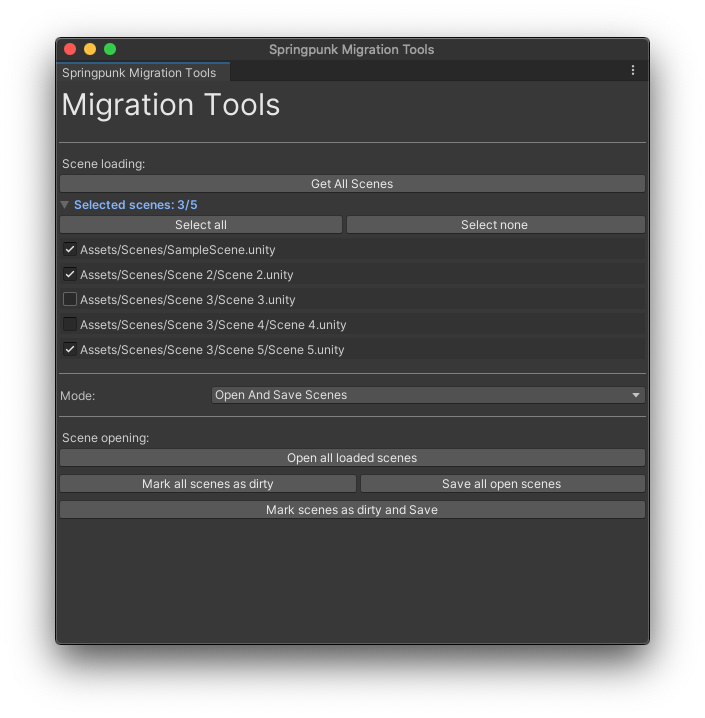

# Migration Tools for Unity

Editor tools to facilitate some steps in migrating/updating to new systems



# Default functionalities

- Project scene selection
- Scene folder and subfolder creation
- Opening scenes, marking them as dirty and saving them
- Custom tool creation

# How to install

- Open the Unity Package Manager (Window > Package Manager)
- Click the "plus" icon in the top left
- Select "Add package from git URL"
- Paste in the git URL for this repo: `https://github.com/springpunk/unity-migration-tools.git`

# Creating a custom tool

Check the [example](Example/ExampleMigrationTool.cs) to see how to implement custom tools

```cs
using UnityEngine.Editor;
using Springpunk.MigrationTools.Editor;

[InitializeOnLoad]
public class MyCustomTool : MigrationTool
{
    // Automatically register the tool for use on editor load
    static MyCustomTool()
    {
        MyCustomTool example = new MyCustomTool();
        MigrationToolsWindow.RegisterCustomTool(example);
    }

    public MyCustomTool() : base("My Custom Tool") { }

    protected override void OnGUI()
    {
        // Editor GUI code goes here...
    }
}

```
